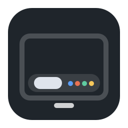
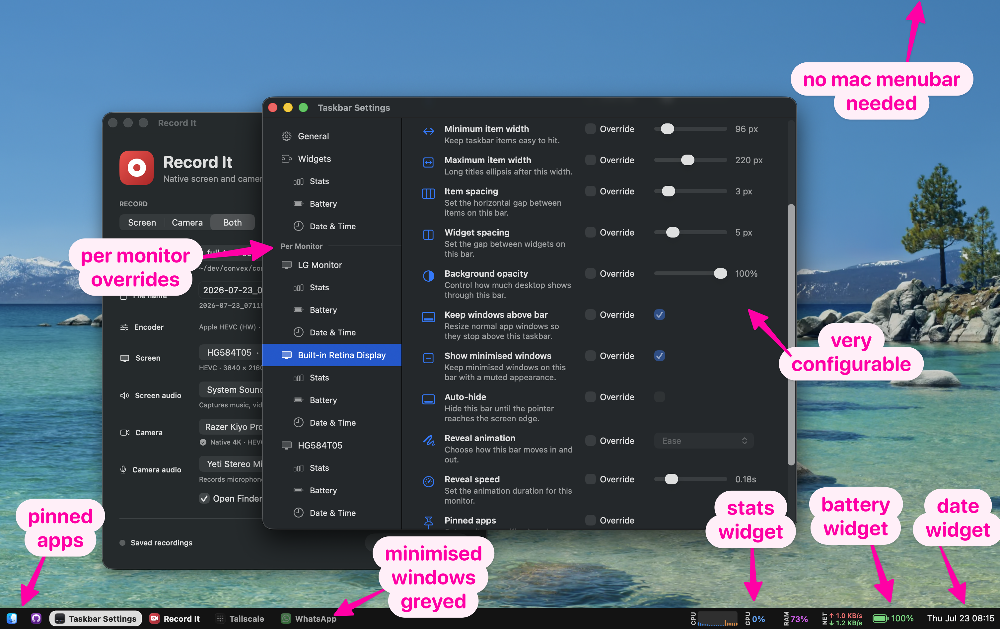

#  taskbar

A Windows-style taskbar for your Mac, one on every monitor

macOS

<!-- media: hero -->
<!--  -->
<!-- media: hero -->



## What it is

This puts a Windows-style taskbar along the bottom of every monitor on macOS. Every window gets its own button instead of being lumped in with its app, and you can pin the apps you always want there.

It has a few little widgets too, like the date and time, battery, CPU and network stats, and a single button that turns my Elgato lights on and off. You can set things globally and then tweak them for each monitor.

## Get it

Paste this into your AI coding agent (Claude Code, Codex, Cursor...):

> Clone https://github.com/mikecann/taskbar and make it my own. It's one of Mike
> Cann's personal tools, so read the README first, change anything specific to his
> setup to suit mine, then help me get it running.

### Or set it up by hand

You need macOS 13 or newer, Git, and Xcode or the Xcode Command Line Tools with
Swift 5.10 or newer. Install the Command Line Tools with `xcode-select --install`
if needed. Python 3 is only needed for the legacy model and launcher tests.
There are no API keys or `.env` files to set up.

```bash
git clone https://github.com/mikecann/taskbar.git
cd taskbar
bash setup_mac.sh
bash install.sh
bash restart.sh
```

`setup_mac.sh` downloads the Swift dependency and builds the app. `install.sh`
puts a symlink to the launcher in `~/.local/bin`; you can choose another directory
with `bash install.sh /path/to/bin`. Add that directory to your PATH if needed:

```bash
export PATH="$HOME/.local/bin:$PATH"
```

Add that line to `~/.zshrc` to keep it for new terminals. Re-run `install.sh` if
you move the clone. `restart.sh` stages and signs the app bundle, then launches
it through launchd. Grant the permissions listed below to that app.

The Swift dependency is [prompter-kit](https://github.com/mikecann/prompter-kit),
version 1.0.0 or newer. It needs to be published with that tag before a fresh
clone can build.

## Using it

```bash
taskbar restart   # Build and relaunch, also the default with no argument
taskbar settings  # Open settings in the running app
taskbar stop      # Stop the app
```

You can also run `bash restart.sh`, `bash open-settings.sh`, or `bash kill.sh`
directly from this clone.

Click a window button to bring it forward, or restore it if it is minimised.
Clicking the already selected window keeps it active. Right-click an app to pin
it, and right-click the bar to open settings for that monitor. Enable Start at
login in settings if you want it to launch automatically.

The bar hides for foreground fullscreen apps and can auto-hide. The settings
also let you keep normal windows above it, adjust button widths and spacing,
and choose widgets for each monitor.

## Settings

Right-click any taskbar and choose settings.

The General page sets the default values. Each monitor page can inherit those
defaults or override individual bar settings for that display. Widget settings
live under the Widgets section instead of being mixed into the bar settings.

Useful settings:

- Taskbar size
- Minimum and maximum item width
- Horizontal spacing between items
- Independent horizontal spacing between widgets
- Background opacity
- Date & Time widget display
- Battery widget with the current charge level and charging state
- Stats widget CPU, RAM, network, and CPU display modes
- One-button toggle for all reachable Elgato Control Center lights
- Auto-hide and reveal animation
- Pinned apps
- Keep windows above bar
- Start at login

Windows on other Spaces are intentionally not shown. Window discovery uses
CGWindowList's `.optionOnScreenOnly`, so each taskbar reflects the windows on
the currently visible Space.

## Widgets

Widgets are built as small AppKit plugins inside the taskbar app. A widget owns
its rendering, right-click menu, and settings controls, while still using the
same global-default plus per-monitor override model as the rest of the bar.

The settings sidebar lists installed widgets under Widgets, and also shows each
monitor's widget override pages under that monitor. Disabled widgets remain
visible in settings so they can be turned back on.

Date & Time uses menu-bar-style text and can show or hide the date, day of week,
seconds, and 24-hour time independently per monitor.

Battery reads the Mac's internal battery through the native IOKit power-source
API. Its wide battery outline fills continuously to the exact percentage and
keeps a charging bolt without replacing the level. It also uses a low-battery
warning colour. Its right-click menu includes the charging state and remaining
time when macOS reports one.

Control Center Lights discovers Elgato lights through Bonjour and shows one
power button. A click reads every reachable light first. If they are all on it
turns them all off; otherwise it turns them all on. The request changes only
power, preserving each light's brightness and colour temperature. When the
button turns the studio on, it also opens `~/Applications/Record It.app` if it
is installed. That is my
[record-it](https://github.com/mikecann/record-it) tool, and you can change
`recordItLaunchURL` in `Sources/TaskbarApp/TaskbarController.swift`
if you want it to open something else.
Turning the studio off leaves Record It alone so an active recording is never
quit unexpectedly.

The widget can optionally include the Elgato Prompter in the same action. Turn
on **Include Elgato Prompter** in the widget settings or its right-click menu.
Taskbar then uses DisplayLink Manager's own per-display switch, matching the
Prompter by name, so turning the studio off also stops its DisplayLink display
stream and turning the studio on reconnects it. This option is off by default
when upgrading so an existing lights button never unexpectedly disables a
display.

The lights button also changes scaling on my PA27JCV display by default, using
larger text when the lights turn on and the default mode when they turn off.
Disable **Scale PA27JCV for Studio** in the widget settings if
that does not suit your setup. The Prompter helper comes from
[prompter-kit](https://github.com/mikecann/prompter-kit).

Stats shows CPU, RAM, and network activity in a compact strip. CPU can show a
percentage, aggregate usage history, or one live utilisation bar per logical
CPU. Per-CPU bars use the performance-level names reported by macOS and colour
Super, Performance, and Efficiency cores differently. Each tier colour can be
changed from the Stats widget settings, globally or per monitor. Its first slice
uses native macOS sampling APIs and takes design/API
inspiration from
[exelban/stats](https://github.com/exelban/stats), which is MIT licensed, but it
does not vendor the full Stats app.

## Permissions

Window titles need Screen Recording permission. Without it, `kCGWindowName`
is blank, which degrades taskbar titles and window matching. Grant Screen
Recording access to the app bundle below.

Keeping windows above the bar uses macOS Accessibility APIs. If that setting is
enabled, grant Accessibility access to the same app bundle:

```text
~/Applications/Mikerosoft Taskbar.app
```

Do not grant the raw SwiftPM binary in `.build`; `restart.sh` stages and signs a
real app bundle so macOS can remember the permission consistently.

The lights widget needs Local Network access to discover and control Elgato
lights. `restart.sh` declares the `_elg._tcp` Bonjour service in the staged app
bundle so macOS can ask for and retain that permission. Prompter control also
needs Taskbar's existing Accessibility permission so it can operate DisplayLink
Manager's own display switch.

Logs go to:

```text
~/Library/Logs/mikerosoft-taskbar.log
```

## Development

Run the Swift tests:

```bash
swift test
```

Run the Python model tests and installer/launcher checks:

```bash
python3 -m unittest discover -s tests -v
```

Restart the app after code changes:

```bash
bash restart.sh
```

## Notes

This started as a Python prototype, so the old Python files are still in this
folder for reference. The real app is now the Swift package under
`Sources/TaskbarApp`.

## More tools

You can find my other tools at [mikerosoft.app](https://mikerosoft.app).

MIT licensed.
